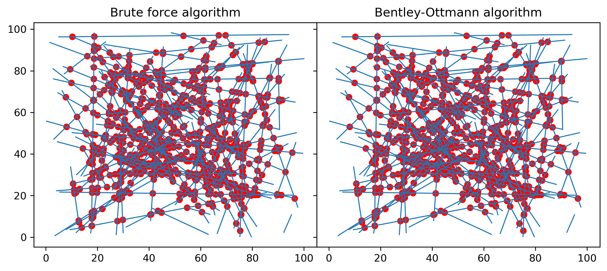
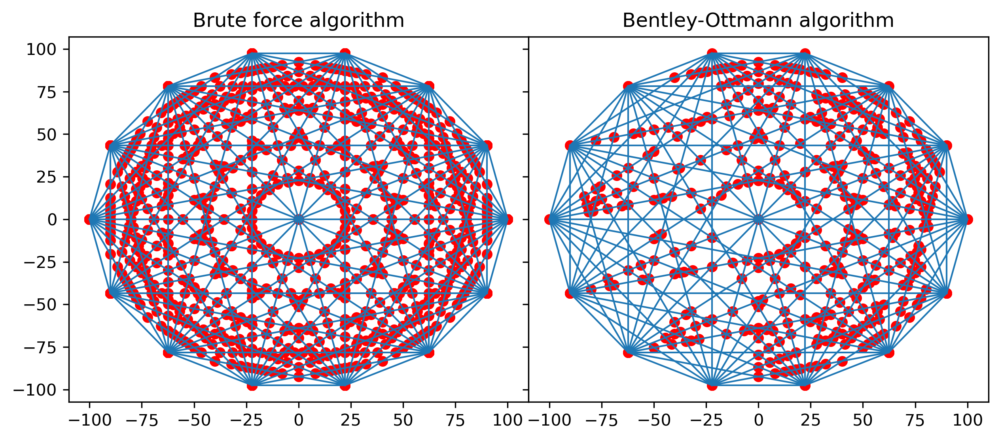

# SegmentIntersections.jl

This package implements two algorithms for computing the intersection points between a set of finite segments. The first algorithm is a brute force algorithm, in which each segment is tested for intersection against all the other segments. The scaling of this algorithm is thus O(N^2). The second algorithm is the [Bentley-Ottmann algorithm](https://en.wikipedia.org/wiki/Bentley%E2%80%93Ottmann_algorithm) which should scale much better for a high number of points. However, in many situations the brute force performs better. This could also be because of the BO algorithm needs a bit of memory optimization.

# Limitations

The algorithm ignores purely horizontal and vertical segments. This will probably be implemented in the future.
